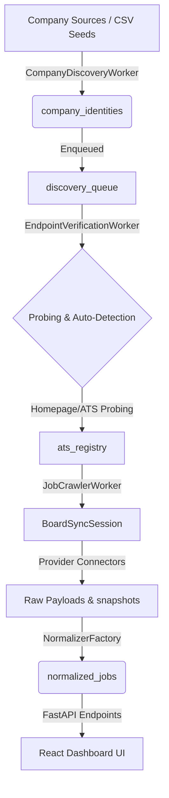

# CareerAutomated System Architecture

This document maps out the system architecture, database schemas, worker states, and end-to-end data flow of CareerAutomated.

---

## 1. System Pipeline & Data Flow



---

## 2. Database Schema

All database entities reside in the central SQLite database: `backend/data/crm.db`.

### `company_identities`
- `company_id` (TEXT, PRIMARY KEY) — URL-friendly slug (e.g. `nvidia`).
- `domain` (TEXT, UNIQUE) — Corporate email/web domain.
- `canonical_name` (TEXT) — Human-readable company name.
- `website` (TEXT) — Corporate homepage URL.

### `ats_registry`
- `id` (TEXT, PRIMARY KEY) — Unique endpoint hash.
- `company_id` (TEXT) — Foreign key matching `company_identities`.
- `ats_type` (TEXT) — Target platform type (`greenhouse`, `lever`, `ashby`, `workday`, `workable`).
- `canonical_endpoint` (TEXT) — Direct URL endpoint of the job board feed.
- `status` (TEXT) — Endpoint health status (`ACTIVE`, `INACTIVE`, `FAILED`).
- `job_count` (INTEGER) — Total jobs extracted in last crawl.
- `last_job_sync` (REAL) — Unix timestamp of last crawl run.
- `last_successful_crawl` (REAL) — Unix timestamp of last successful crawl run.

### `normalized_jobs`
- `job_id` (TEXT, PRIMARY KEY) — Unique job hash (identity).
- `provider_job_id` (TEXT) — External identifier from source ATS.
- `company_id` (TEXT) — Foreign key matching `company_identities`.
- `provider` (TEXT) — ATS platform provider name.
- `title` (TEXT) — Clean job title.
- `department` (TEXT) — Associated team or organization department.
- `location` (TEXT) — Location description (e.g. `Bangalore, India`).
- `remote_type` (TEXT) — Remote working option (`Remote`, `Hybrid`, `Onsite`).
- `employment_type` (TEXT) — Job classification (`Full-Time`, `Contract`).
- `posted_at` (TEXT) — Sync date or parsed publication date.
- `apply_url` (TEXT) — Destination application page link.
- `description` (TEXT) — Job description (HTML or text payload).
- `job_hash` (TEXT) — SHA256 content signature used to detect updates.
- `status` (TEXT) — Job state (`ACTIVE`, `CLOSED`, `UPDATED`).
- `raw_payload_json` (TEXT) — Full raw payload from the source crawler.

### `worker_states`
- `worker_name` (TEXT, PRIMARY KEY) — Target worker class name.
- `pid` (INTEGER) — OS Process ID.
- `status` (TEXT) — Execution status (`STARTING`, `RUNNING`, `STOPPED`).
- `started_at` (TEXT) — Timestamp of worker start.
- `heartbeat` (TEXT) — Last updated timestamp of active state.
- `jobs_processed` (INTEGER) — Number of items successfully processed.
- `failures` (INTEGER) — Cumulative failure count.
- `last_error` (TEXT) — Last recorded stack trace or error message.

### `local_queues`
- `item_id` (TEXT, PRIMARY KEY) — Queue item ID (UUID).
- `queue_name` (TEXT) — Queue ID (`discovery_queue`, `verification_queue`, `crawl_queue`, `application_queue`).
- `payload` (JSON) — JSON dictionary specifying task inputs.
- `status` (TEXT) — Queue state (`QUEUED`, `PROCESSING`, `DEAD`).
- `locked_until` (INTEGER) — Epoch timestamp showing checkout lock expiry.
- `created_at` (INTEGER) — Epoch timestamp of enqueue.

---

## 3. Worker Architecture

All workers subclass `BaseWorker` and run as infinite daemons managed by the `PipelineScheduler`:

1. **`CompanyDiscoveryWorker`** (`backend/src/workers/company_discovery_worker.py`)
   - Reads CSV seeds in `backend/benchmark/companies.csv`.
   - Populates `company_identities` using `INSERT OR IGNORE`.
   - Feeds new target companies into the `discovery_queue`.
2. **`EndpointVerificationWorker`** (`backend/src/workers/endpoint_verification_worker.py`)
   - Pops targets from `discovery_queue`.
   - Leverages `DiscoveryOrchestrator` to detect and verify active ATS board links.
   - Promotes successful endpoints directly into the `ats_registry`.
3. **`JobCrawlerWorker`** (`backend/src/workers/job_crawler_worker.py`)
   - Continuously checks for active verified boards needing synchronization.
   - Triggers `BoardSyncSession` to pull, normalize, and upsert records into `normalized_jobs`.
4. **`CleanupWorker`** (`backend/src/workers/cleanup_worker.py`)
   - Performs periodic DB optimization tasks (e.g. `ANALYZE`, `VACUUM`).
   - Manages retry intervals and unlocks stalled queue payloads.

---

## 4. Connectors & Registries

Provider-specific connectors inherit from `Connector` and are decoupled from the synchronization pipeline:

- **`ConnectorRegistry`** (`backend/src/discovery/registry/connector_registry.py`)
  - Exposes the registration map for custom platforms:
    ```python
    ConnectorRegistry.register("greenhouse", GreenhouseConnector)
    ```
- **Connectors**:
  - `GreenhouseConnector` (`backend/src/discovery/connectors/greenhouse.py`)
  - `LeverConnector` (`backend/src/discovery/connectors/lever.py`)
  - `WorkdayConnector` (`backend/src/discovery/connectors/workday.py`)
  - `AshbyConnector` (`backend/src/discovery/workers/ashby_adapter.py`)
- **`BoardSyncSession`**: Coordinates HTTP connections, ETag handling, raw archiving, normalizer routing, and database writes.

---

## 5. API Endpoints (FastAPI)

Exposed under `/api/v1` of port `8000`:

- `GET /api/v1/dashboard` — Unified dashboard summary stats, worker statuses, and queue metrics.
- `GET /api/v1/jobs` — Main paginated, searchable job database.
- `GET /api/v1/jobs/{job_id}` — Job details drawer matching keywords.
- `GET /api/v1/companies` — Live corporate crawling health and counts.
- `GET /api/v1/discovery` — Live discovery queue statistics.
- `GET /api/v1/workers` — Map of running process states.
