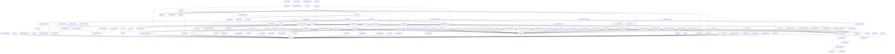

# Internal Architecture Dependency Graph

This graph was automatically generated by parsing the AST of the `src/` directory to track how your modules depend on each other.

```mermaid
graph TD;
    event_bus --> config;
    ats_learning_engine --> database;
    discovery_session --> config;
    greenhouse_board_discovery --> database;
    discovery_queue --> config;
    scan_budget_manager --> database;
    normalizer --> base_provider;
    company_discovery_engine --> source_manager;
    company_discovery_engine --> event_bus;
    company_discovery_engine --> role_discovery_engine;
    company_discovery_engine --> database;
    discovery_engine_v2 --> priority_scheduler;
    discovery_engine_v2 --> database;
    discovery_engine_v2 --> provider_manager;
    hard_reject_filter --> search_planner;
    priority_scheduler --> scan_budget_manager;
    priority_scheduler --> database;
    connector_registry --> discovery_connector;
    workday_connector --> discovery_connector;
    wellfound_connector --> discovery_connector;
    wellfound_connector --> search_planner;
    wellfound_connector --> search_connector_base;
    search_connector_base --> discovery_connector;
    search_connector_base --> search_planner;
    linkedin_connector --> discovery_connector;
    linkedin_connector --> search_planner;
    linkedin_connector --> search_connector_base;
    indeed_connector --> discovery_connector;
    indeed_connector --> search_planner;
    indeed_connector --> search_connector_base;
    markdown_job_parser --> base_provider;
    analyzer --> models;
    extractor --> models;
    normalizer --> models;
    yc_importer --> database;
    manual_importer --> database;
    indian_startups_importer --> database;
    github_ai_importer --> database;
    repository_manager --> database;
    source_manager --> repository_manager;
    source_manager --> database;
    company_seeder --> database;
    ashby_provider --> database;
    ashby_provider --> base_provider;
    provider_manager --> base_provider;
    base_provider --> discovery_cache;
    workable_provider --> config;
    workable_provider --> base_provider;
    lever_provider --> database;
    lever_provider --> base_provider;
    eligibility_rule_provider --> config;
    linkedin_jobs_provider --> apify_manager;
    linkedin_jobs_provider --> config;
    linkedin_jobs_provider --> base_provider;
    curated_repository_provider --> markdown_job_parser;
    curated_repository_provider --> source_manager;
    curated_repository_provider --> database;
    curated_repository_provider --> base_provider;
    curated_repository_provider --> ats_detector;
    curated_repository_provider --> company_intelligence_engine;
    indeed_provider --> query_generator;
    indeed_provider --> database;
    indeed_provider --> base_provider;
    indeed_provider --> ats_detector;
    indeed_provider --> company_intelligence_engine;
    company_careers_provider --> base_provider;
    generic_careers_provider --> config;
    generic_careers_provider --> base_provider;
    greenhouse_provider --> database;
    greenhouse_provider --> base_provider;
    apify_provider --> base_provider;
    wellfound_provider --> base_provider;
    company_search_provider --> base_provider;
    greenhouse_board_provider --> database;
    google_jobs_provider --> apify_manager;
    google_jobs_provider --> base_provider;
    company_intelligence_provider --> base_discovery_provider;
    company_intelligence_provider --> database;
    internet_search_provider --> base_discovery_provider;
    internet_search_provider --> query_generator;
    internet_search_provider --> config;
    query_generator --> base_discovery_provider;
    backend_factory --> native_http_backend;
    backend_factory --> base_backend;
    native_http_backend --> rate_limiter;
    native_http_backend --> base_backend;
    discovery_cache --> backend_factory;
    discovery_cache --> base_backend;
    vc_connectors --> aggregator;
    yc_connectors --> company_orchestrator;
    greenhouse_source --> base;
    llm_router --> groq_manager;
    llm_router --> config;
    llm_router --> database;
    profile_parser --> config;
    groq_manager --> config;
    queue --> database;
    home --> config;
    applications --> config;
    outreach --> database;
    agents --> database;
    jobs --> database;
    settings --> config;
    analytics --> database;
    candidate --> config;
    database --> config;
    apify_manager --> config;
    dispatcher --> base_adapter;
    dispatcher --> greenhouse_adapter;
    match_engine --> config;
    app_queue --> config;
    email_confirmation --> config;
    feedback_tracker --> config;
    otp_retriever --> config;
    question_engine --> llm_router;
    question_engine --> config;
    question_engine --> profile;
    engine --> app_queue;
    engine --> intelligence;
    engine --> llm_router;
    engine --> rag;
    engine --> profile;
    engine --> config;
    engine --> executor;
    rag --> config;
    profile_extractor_v2 --> llm_router;
    executor --> email_confirmation;
    executor --> eligibility_filter;
    executor --> early_abort;
    executor --> greenhouse;
    executor --> profile;
    executor --> config;
    greenhouse_adapter --> base_adapter;
    greenhouse_adapter --> greenhouse;
    greenhouse --> question_classifier;
    greenhouse --> question_engine;
    greenhouse --> verifier;
    greenhouse --> otp_retriever;
    greenhouse --> profile;
    outreach_worker --> config;
    outreach_worker --> database;
    discovery_worker --> config;
    discovery_worker --> wellfound_scraper;
    discovery_worker --> database;
    startup_health --> config;
    startup_health --> database;
    match_worker --> match_engine;
    match_worker --> database;
    match_worker --> config;
    application_worker --> config;
    application_worker --> wellfound;
    application_worker --> database;
    application_worker --> feedback_tracker;
    main_cron --> config;
    activities --> dependencies;
    daemons --> dependencies;
    contacts --> dependencies;
    applications --> dependencies;
    jobs --> jobs_repository;
    jobs --> dependencies;
    settings --> dependencies;
    analytics --> analytics_repository;
    analytics --> dependencies;
    companies --> dependencies;
    mission_control --> matching;
    mission_control --> config;
    mission_control --> database;
    mission_control --> discovery;
    stages --> hard_reject_filter;
    stages --> scoring_engine;
    stages --> stage;
    stages --> provider_manager;
    stages --> deduplicator;
    stages --> search_planner;
    run_pipeline --> stage;
    run_pipeline --> stages;
    enrichment --> config;
    enrichment --> database;
    audit_routing --> ranking;
    audit_routing --> config;
    discovery --> ranking;
    discovery --> config;
    discovery --> provider_manager;
    discovery --> deduplicator;
    deduplicator --> config;
    quality_filter --> config;
    matching --> search_planner;
    ranking --> config;
    application_judge --> llm_router;
    application_judge --> config;
    apify_provider --> base_provider;
    apify_provider --> config;
    apify_provider --> apify_manager;
    csv_provider --> base_provider;
    enrichment --> config;
    strategy --> config;
    strategy --> database;
    email_client --> config;
    engine --> intelligence;
    engine --> config;
    engine --> project_selector;
    engine --> prompts;
    engine --> groq_manager;
    engine --> llm_router;
    engine --> email_client;
    engine --> profile_parser;
    engine --> critic;
    run_batch --> config;
    run_batch --> engine;
    run_batch --> database;
    scheduler --> run_batch;
    briefing --> config;
    briefing --> database;
    critic --> config;
    critic --> groq_manager;
    inbox_reader --> llm_router;
    inbox_reader --> state_machine;
    inbox_reader --> config;
    inbox_reader --> database;
    discovery_failure_report --> config;
    sources --> config;
    opportunity_verification --> config;
    funnel --> config;
    provider_effectiveness --> config;
```
